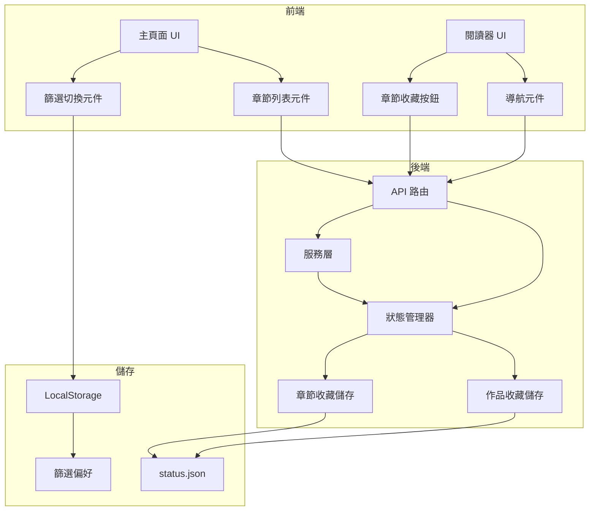

# 設計文件：章節級收藏功能

## 概述

此設計擴展現有的作品級收藏系統，支援章節級收藏並提供全域篩選功能。系統允許使用者標記個別章節為收藏，在主頁面切換全域「只顯示收藏」篩選，並在閱讀器中無縫導航已收藏的章節。

此設計維持與現有作品級收藏系統的向後相容性，同時為章節特定偏好增加新的粒度層級。

## 架構

### 高階架構



### 資料流

1. **收藏切換流程**：
   - 使用者在閱讀器中點擊收藏按鈕
   - 前端發送 POST 請求到 `/api/chapter-status/<chapter_path>`
   - 後端更新 StatusManager
   - StatusManager 持久化到 `status.json`
   - 前端立即更新 UI

2. **篩選切換流程**：
   - 使用者切換「只顯示收藏」核取方塊
   - 前端儲存偏好到 LocalStorage
   - 前端請求篩選後的章節列表
   - 後端使用 StatusManager 篩選章節
   - 前端顯示篩選結果

3. **導航流程**：
   - 使用者點擊上一頁/下一頁或使用鍵盤
   - 前端從 LocalStorage 檢查篩選狀態
   - 前端請求帶有篩選參數的導航資訊
   - 後端根據篩選計算上一頁/下一頁
   - 前端導航到適當的章節

## 元件與介面

### 後端元件

#### 1. StatusManager 擴展

**檔案**：`src/core/status_manager.py`

**新方法**：

```python
def get_chapter_status(self, category: str, work_path: str, chapter_path: str) -> str:
    """
    取得特定章節的收藏狀態。
    
    Args:
        category: 'manga' 或 'gallery'
        work_path: 作品資料夾名稱
        chapter_path: 相對於根目錄的完整章節路徑
        
    Returns:
        'favorite' 或 'unfavorite'
    """
    pass

def set_chapter_status(self, category: str, work_path: str, chapter_path: str, is_favorite: bool) -> bool:
    """
    設定特定章節的收藏狀態。
    
    Args:
        category: 'manga' 或 'gallery'
        work_path: 作品資料夾名稱
        chapter_path: 相對於根目錄的完整章節路徑
        is_favorite: True 表示收藏，False 表示取消收藏
        
    Returns:
        成功狀態
    """
    pass

def get_favorite_chapters(self, category: str, work_path: str) -> List[str]:
    """
    取得作品的所有已收藏章節路徑。
    
    Args:
        category: 'manga' 或 'gallery'
        work_path: 作品資料夾名稱
        
    Returns:
        章節路徑列表
    """
    pass

def filter_chapters_by_favorite(self, category: str, work_path: str, chapters: List[dict]) -> List[dict]:
    """
    篩選章節列表，只包含收藏的章節。
    
    Args:
        category: 'manga' 或 'gallery'
        work_path: 作品資料夾名稱
        chapters: 章節字典列表
        
    Returns:
        篩選後的章節列表
    """
    pass
```

#### 2. 服務層擴展

**檔案**：`src/modules/manga/service.py`、`src/modules/gallery/service.py`

**修改的方法**：

```python
def get_chapters(self, work_path, filter_favorites=False, status_manager=None):
    """
    取得作品的章節，可選擇性地按收藏篩選。
    
    Args:
        work_path: 作品目錄路徑
        filter_favorites: 如果為 True，只返回已收藏的章節
        status_manager: StatusManager 實例用於篩選
        
    Returns:
        包含收藏狀態的章節字典列表
    """
    pass

def get_chapter_navigation(self, chapter_path, filter_favorites=False, status_manager=None):
    """
    取得導航資訊，遵循收藏篩選。
    
    Args:
        chapter_path: 當前章節路徑
        filter_favorites: 如果為 True，只在收藏章節間導航
        status_manager: StatusManager 實例
        
    Returns:
        包含上一頁/下一頁章節的導航字典
    """
    pass
```

#### 3. API 路由擴展

**檔案**：`src/modules/manga/routes.py`、`src/modules/gallery/routes.py`

**新端點**：

```python
@manga_bp.route('/api/chapter-status/<path:chapter_path>', methods=['GET'])
def get_chapter_status(chapter_path):
    """取得章節的收藏狀態。"""
    pass

@manga_bp.route('/api/chapter-status/<path:chapter_path>', methods=['POST'])
def set_chapter_status(chapter_path):
    """設定章節的收藏狀態。"""
    pass

@manga_bp.route('/api/favorite-chapters/<path:work_path>', methods=['GET'])
def get_favorite_chapters(work_path):
    """取得作品的所有已收藏章節。"""
    pass
```

**修改的端點**：

```python
@manga_bp.route('/api/<path:manga_path>')
def get_detail(manga_path):
    """
    修改為接受 filter_favorites 查詢參數。
    返回包含收藏狀態的章節。
    """
    pass

@manga_bp.route('/api/chapter/<path:chapter_path>')
def get_chapter_images(chapter_path):
    """
    修改為接受 filter_favorites 查詢參數。
    返回遵循篩選的導航資訊。
    """
    pass
```

### 前端元件

#### 1. 篩選切換元件

**檔案**： 
- `src/modules/manga/templates/manga/index.html`
- `src/modules/gallery/templates/gallery/index.html`

**HTML 結構**：

```html
<div class="filter-controls">
    <label class="filter-toggle">
        <input type="checkbox" id="showOnlyFavorites" onchange="toggleFavoriteFilter()">
        <span>只顯示收藏</span>
    </label>
</div>
```

**JavaScript 函式**：

```javascript
function loadFilterPreference() {
    // 從 localStorage 載入
    const filterEnabled = localStorage.getItem('showOnlyFavorites') === 'true';
    document.getElementById('showOnlyFavorites').checked = filterEnabled;
    return filterEnabled;
}

function toggleFavoriteFilter() {
    const enabled = document.getElementById('showOnlyFavorites').checked;
    localStorage.setItem('showOnlyFavorites', enabled);
    refreshChapterLists();
}

function refreshChapterLists() {
    // 使用當前篩選重新載入所有作品章節列表
}
```

#### 2. 章節列表元件

**檔案**：
- `src/static/js/manga/index.js`
- `src/static/js/gallery/index.js`

**修改的函式**：

```javascript
async function loadMangaDetail(mangaPath) {
    const filterEnabled = localStorage.getItem('showOnlyFavorites') === 'true';
    const url = `/manga/api/${mangaPath}?filter_favorites=${filterEnabled}`;
    // 取得並顯示章節
}

function renderChapter(chapter) {
    // 添加收藏指示器星星圖示
    const favoriteIcon = chapter.is_favorite ? '★' : '☆';
    // 渲染帶有圖示的章節
}
```

#### 3. 閱讀器收藏按鈕

**檔案**：
- `src/modules/manga/templates/manga/reader.html`
- `src/modules/gallery/templates/gallery/reader.html`

**HTML 結構**：

```html
<button id="chapterFavoriteBtn" class="chapter-favorite-btn" onclick="toggleChapterFavorite()" title="收藏此章節">
    <span id="chapterFavoriteStar">☆</span>
</button>
```

**JavaScript 函式**：

```javascript
async function loadChapterFavoriteStatus() {
    const response = await fetch(`/manga/api/chapter-status/${currentChapterPath}`);
    const data = await response.json();
    updateChapterFavoriteButton(data.is_favorite);
}

async function toggleChapterFavorite() {
    const currentlyFavorite = document.getElementById('chapterFavoriteStar').textContent === '★';
    const response = await fetch(`/manga/api/chapter-status/${currentChapterPath}`, {
        method: 'POST',
        headers: {'Content-Type': 'application/json'},
        body: JSON.stringify({is_favorite: !currentlyFavorite})
    });
    const data = await response.json();
    updateChapterFavoriteButton(data.is_favorite);
}

function updateChapterFavoriteButton(isFavorite) {
    document.getElementById('chapterFavoriteStar').textContent = isFavorite ? '★' : '☆';
}
```

#### 4. 導航元件

**檔案**：
- `src/static/js/manga/reader.js`
- `src/static/js/gallery/reader.js`

**修改的函式**：

```javascript
async function loadNavigationInfo() {
    const filterEnabled = localStorage.getItem('showOnlyFavorites') === 'true';
    const url = `/manga/api/chapter/${currentChapterPath}?filter_favorites=${filterEnabled}`;
    const response = await fetch(url);
    const data = await response.json();
    updateNavigationButtons(data.navigation);
}

function updateNavigationButtons(navigation) {
    // 根據 navigation.prev/next 啟用/停用上一頁/下一頁
    // 更新按鈕狀態
}

function goToNextChapter() {
    if (navigation.next) {
        window.location.href = `/manga/reader/${navigation.next.path}`;
    }
}

function goToPrevChapter() {
    if (navigation.prev) {
        window.location.href = `/manga/reader/${navigation.prev.path}`;
    }
}
```

## 資料模型

### 儲存結構

**檔案**：`data/status.json`

```json
{
  "manga": {
    "favorite": ["work1", "work2"],
    "reviewed": ["work3"],
    "chapter_favorites": {
      "work1": ["work1/chapter1", "work1/chapter5", "work1/chapter10"],
      "work2": ["work2/chapter3"]
    }
  },
  "gallery": {
    "favorite": ["gallery1"],
    "reviewed": ["gallery2"],
    "chapter_favorites": {
      "gallery1": ["gallery1/set1", "gallery1/set3"]
    }
  }
}
```

### LocalStorage 結構

**鍵**：`showOnlyFavorites`
**值**：`"true"` 或 `"false"`

如果漫畫和 Gallery 有獨立頁面，則分別儲存，否則全域儲存。

### API 請求/回應格式

**GET /api/chapter-status/<chapter_path>**

回應：
```json
{
  "chapter_path": "manga1/chapter5",
  "is_favorite": true
}
```

**POST /api/chapter-status/<chapter_path>**

請求：
```json
{
  "is_favorite": true
}
```

回應：
```json
{
  "success": true,
  "chapter_path": "manga1/chapter5",
  "is_favorite": true
}
```

**GET /api/favorite-chapters/<work_path>**

回應：
```json
{
  "work_path": "manga1",
  "favorite_chapters": [
    "manga1/chapter1",
    "manga1/chapter5",
    "manga1/chapter10"
  ]
}
```

**GET /api/<work_path>?filter_favorites=true**

回應：
```json
{
  "name": "manga1",
  "path": "manga1",
  "chapters": [
    {
      "name": "chapter1",
      "path": "manga1/chapter1",
      "image_count": 20,
      "is_favorite": true
    },
    {
      "name": "chapter5",
      "path": "manga1/chapter5",
      "image_count": 25,
      "is_favorite": true
    }
  ]
}
```

**GET /api/chapter/<chapter_path>?filter_favorites=true**

回應：
```json
{
  "images": ["url1", "url2", ...],
  "navigation": {
    "prev": {
      "name": "chapter1",
      "path": "manga1/chapter1"
    },
    "next": {
      "name": "chapter10",
      "path": "manga1/chapter10"
    },
    "manga_name": "manga1",
    "current_chapter": {
      "name": "chapter5",
      "path": "manga1/chapter5"
    }
  }
}
```

## 正確性屬性

*屬性是在系統所有有效執行中都應該成立的特徵或行為——本質上是關於系統應該做什麼的正式陳述。屬性作為人類可讀規範和機器可驗證正確性保證之間的橋樑。*

### 屬性 1：章節收藏切換一致性

*對於任何*作品中的任何章節，切換收藏按鈕應在已收藏和未收藏狀態之間交替，且 UI 應立即反映當前狀態。

**驗證需求：需求 1.2、1.3**

### 屬性 2：章節收藏持久化

*對於任何*被收藏的章節，章節路徑應立即儲存在狀態資料結構中，且查詢儲存應返回已收藏狀態。

**驗證需求：需求 1.4、5.1**

### 屬性 3：章節收藏往返

*對於任何*章節，如果我們收藏它、離開閱讀器並返回該章節，系統應正確顯示已收藏狀態。

**驗證需求：需求 1.5**

### 屬性 4：篩選偏好持久化

*對於任何*「只顯示收藏」核取方塊的狀態，切換它應將偏好持久化到 localStorage，且儲存的值應與核取方塊狀態匹配。

**驗證需求：需求 2.2、2.3、7.1、7.2**

### 屬性 5：篩選偏好往返

*對於任何*篩選偏好設定，如果我們設定偏好、重新整理頁面，系統應從 localStorage 正確恢復偏好。

**驗證需求：需求 2.4、7.3**

### 屬性 6：全域篩選應用

*對於任何*在一個模組（漫畫或 Gallery）中設定的篩選偏好，導航到另一個模組時應套用相同的偏好。

**驗證需求：需求 2.5**

### 屬性 7：章節列表篩選

*對於任何*混合已收藏和未收藏章節的作品，當「只顯示收藏」篩選啟用時，列表中應只出現已收藏的章節，當停用時，所有章節應按順序出現。

**驗證需求：需求 3.1、3.2**

### 屬性 8：篩選後章節順序保持

*對於任何*已收藏章節集合，篩選章節列表應維持已收藏章節的原始相對順序。

**驗證需求：需求 3.4**

### 屬性 9：即時篩選更新

*對於任何*收藏狀態改變的章節，篩選後的章節列表應立即更新而無需重新整理頁面。

**驗證需求：需求 3.5**

### 屬性 10：帶篩選的智慧導航

*對於任何*當前章節位置，當「只顯示收藏」篩選啟用時，點擊上一頁/下一頁（或使用鍵盤快捷鍵）應導航到上一個/下一個已收藏章節，當停用時，應按順序導航到相鄰章節。

**驗證需求：需求 4.1、4.2、4.3、4.4**

### 屬性 11：章節取消收藏儲存移除

*對於任何*被取消收藏的章節，章節路徑應立即從狀態資料結構中移除。

**驗證需求：需求 5.2**

### 屬性 12：系統重啟持久化

*對於任何*已收藏章節集合，如果我們重啟系統，所有章節收藏狀態應從持久化儲存正確載入。

**驗證需求：需求 5.3**

### 屬性 13：章節和作品收藏分離

*對於任何*作品，收藏該作品中的章節不應影響作品級收藏狀態，反之亦然——兩者應獨立儲存和管理。

**驗證需求：需求 5.4**

### 屬性 14：跨類別章節收藏

*對於任何*漫畫或 Gallery 類別中的章節，系統應支援收藏並在相同的儲存結構中正確儲存收藏狀態。

**驗證需求：需求 5.5**

### 屬性 15：章節狀態 API 正確性

*對於任何*章節路徑，對 `/api/chapter-status/<chapter_path>` 的 GET 請求應返回當前收藏狀態，帶有收藏狀態的 POST 請求應正確更新章節狀態。

**驗證需求：需求 6.1、6.2**

### 屬性 16：收藏章節列表 API 正確性

*對於任何*作品路徑，對 `/api/favorite-chapters/<work_path>` 的 GET 請求應返回該作品所有已收藏章節路徑的完整列表。

**驗證需求：需求 6.3**

### 屬性 17：API 錯誤處理

*對於任何*無效的 API 請求（格式錯誤的路徑、缺少參數、不存在的章節），系統應返回適當的 HTTP 錯誤狀態碼（4xx 或 5xx）和描述性錯誤訊息。

**驗證需求：需求 6.4**

### 屬性 18：跨類別 API 支援

*對於任何*漫畫或 Gallery 類別中的章節，章節狀態 API 應對兩個類別都正確工作。

**驗證需求：需求 6.5、5.5**

### 屬性 19：視覺指示器一致性

*對於任何*章節，當已收藏時應顯示實心星星（★），當未收藏時應顯示空心星星（☆），在主頁面和閱讀器之間保持一致。

**驗證需求：需求 8.1、8.2、8.4**

### 屬性 20：篩選狀態視覺指示

*對於任何*「只顯示收藏」篩選的狀態，當啟用時，系統應提供清晰的視覺指示器表明篩選處於啟用狀態。

**驗證需求：需求 8.3**

### 屬性 21：懸停回饋

*對於任何*章節的收藏指示器，懸停在其上應提供視覺回饋（如縮放或顏色變化）。

**驗證需求：需求 8.5**

## 錯誤處理

### 章節不存在
- 當章節路徑不存在時，API 應返回 404 並附帶訊息：`{"error": "章節不存在"}`
- 導航應優雅地處理缺失的章節，停用導航按鈕

### 無效的收藏狀態
- 當提供無效的收藏狀態（非布林值）時，API 應返回 400 並附帶訊息：`{"error": "無效的收藏狀態"}`

### 儲存失敗
- 當無法寫入 status.json 時，系統應記錄錯誤並返回 500 並附帶訊息：`{"error": "儲存收藏狀態失敗"}`
- UI 應向使用者顯示錯誤通知

### LocalStorage 不可用
- 當 localStorage 不可用（私密瀏覽）時，系統應回退到僅限會話的篩選偏好
- 應顯示警告：「篩選偏好不會在會話間持久化」

### 並發更新
- 當多個分頁更新同一章節的收藏狀態時，最後寫入獲勝
- UI 應輪詢或使用儲存事件保持同步

## 測試策略

### 雙重測試方法

此功能將使用單元測試和基於屬性的測試進行驗證：

- **單元測試**：驗證特定範例、邊界情況和錯誤條件
- **屬性測試**：驗證所有輸入的通用屬性

兩種類型的測試是互補的，對於全面覆蓋都是必要的。

### 基於屬性的測試

我們將使用 **pytest 與 Hypothesis** 進行 Python 的基於屬性測試。

**配置**：
- 每個屬性測試最少 100 次迭代
- 每個屬性測試必須引用其設計文件屬性
- 標籤格式：`# Feature: chapter-favorites, Property {number}: {property_text}`

**屬性測試結構範例**：

```python
from hypothesis import given, strategies as st
import pytest

# Feature: chapter-favorites, Property 1: 章節收藏切換一致性
@given(
    category=st.sampled_from(['manga', 'gallery']),
    work_path=st.text(min_size=1, max_size=50),
    chapter_path=st.text(min_size=1, max_size=100)
)
@pytest.mark.property_test
def test_chapter_favorite_toggle_consistency(category, work_path, chapter_path):
    """對於任何章節，切換收藏應交替狀態。"""
    # 測試實作
    pass
```

### 單元測試

單元測試將專注於：
- 展示正確行為的特定範例（例如，章節 1、5、10 導航）
- 邊界情況（無收藏、全部收藏、單一章節）
- 錯誤條件（無效路徑、儲存失敗）
- 元件間整合

### 測試覆蓋範圍

1. **StatusManager 測試**
   - 章節收藏 CRUD 操作
   - 篩選操作
   - 儲存持久化
   - 跨類別支援

2. **服務層測試**
   - 章節列表篩選
   - 帶篩選的導航計算
   - 與 StatusManager 整合

3. **API 測試**
   - 端點正確性
   - 請求/回應格式
   - 錯誤處理
   - HTTP 狀態碼

4. **前端測試**
   - UI 元件渲染
   - LocalStorage 操作
   - 事件處理
   - 視覺回饋

5. **整合測試**
   - 端到端收藏工作流程
   - 篩選切換工作流程
   - 導航工作流程
   - 跨模組一致性
